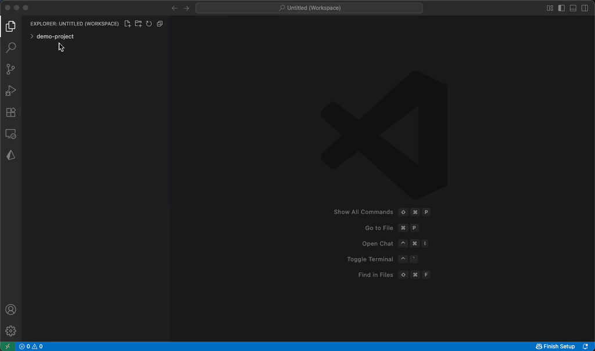

# Concatenate for AI

A powerful VS Code extension that bundles multiple files or entire directories into a single, formatted Markdown document. It is optimized for providing context to AI tools like **Google Gemini 3.0 Pro**, **ChatGPT (o1, 4o)**, **Claude 3.5 Sonnet**, and other Large Language Models (LLMs).



## Why You Need This

Working with LLMs often requires providing multiple code files to establish context. Manually copying and pasting files is tedious and loses structural information. This extension solves common challenges:

- **Streamline AI-assisted programming**: Quickly assemble relevant project files into one prompt-ready block.
- **Preserve Context**: Maintains file paths and directory structures so the AI understands your architecture.
- **Smart Filtering**: Automatically respects your `.gitignore` rules and skips binary files to keep your token count efficient.

## Features

### Smart Concatenation
- **Select Individual Files**: Hand-pick specific files from the Explorer.
- **Recursive Folder Search**: Right-click a folder to find and concatenate all relevant files within it.
- **.gitignore Support**: The extension reads your `.gitignore` files (and nested ones) to ensure you don't accidentally send `node_modules`, build artifacts, or secrets to the AI.
- **Binary Safety**: Automatically detects and skips binary files to prevent encoding errors.

### Context Awareness
- **File Hierarchy Tree**: Optionally prepend an ASCII tree of your project structure to the output. This gives the AI a "map" of your project, even for files you didn't include in the full content.
- **Smart Formatting**: Wraps code files in syntax-highlighted blocks (e.g., ` ```ts `), but preserves the readability of documentation files (like `.md` or `.mdx`) by separating them with horizontal rules instead of code fences.

## How to Use

1.  In the VS Code Explorer:
    -   **For specific files**: Select multiple files (using `Ctrl/Cmd+Click`).
    -   **For folders**: Right-click a folder (or multiple folders).
2.  Choose one of the commands from the context menu:
    -   **Concatenate selected files as new document**
    -   **Concatenate files in folder as new document**
3.  A new unsaved document will open with your formatted content.
4.  Copy the text and paste it into your AI chat window.

## Configuration

You can customize the extension behavior in VS Code Settings (`Cmd+,`):

| Setting | Default | Description |
| :--- | :--- | :--- |
| `concatenate.recursiveSearchFileExtensions` | `["mdx", "ts", "js"]` | List of file extensions to include when recursively scanning folders. |
| `concatenate.prependFileHierarchy` | `false` | If enabled, adds a full ASCII file tree of the root directory to the top of the document. |
| `concatenate.noFenceExtensions` | `["md", "mdx"]` | List of extensions to format without code blocks (useful for Markdown files). |

## Feedback & Contributions

Issues and contributions are welcome on [GitHub](https://github.com/ionsignal/vscode.concatenate.ai).

## License

MIT