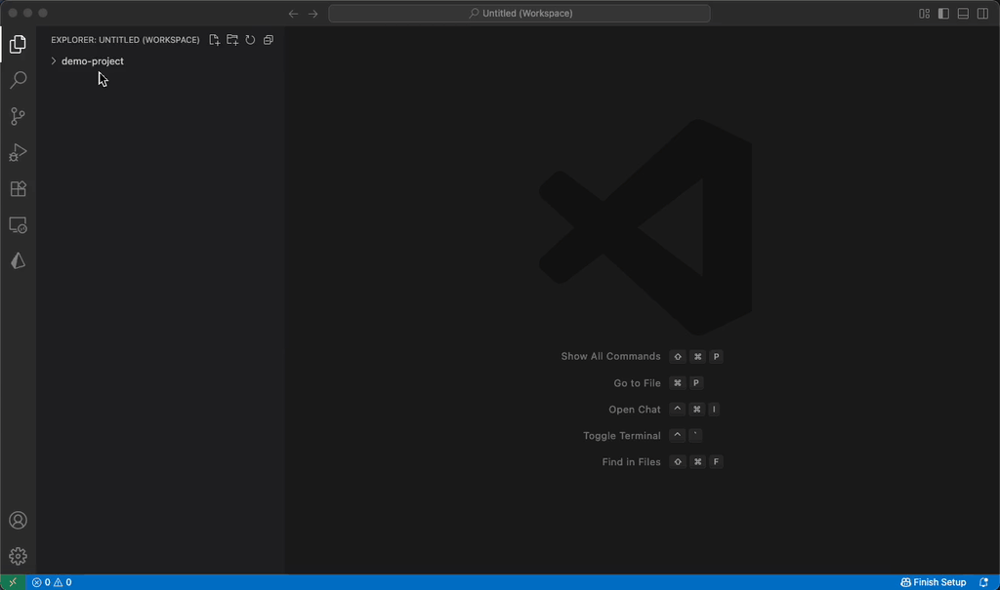

# Concatenate for AI

Concatenate for AI creates one unsaved Markdown document from files and folders selected in the VS Code Explorer. Use the generated document to provide source and documentation context to Fable or GPT-5.6.



## What does the extension include?

- **Selected files:** Includes explicitly selected files, even when their extensions are not listed in `concatenate.recursiveSearchFileExtensions`.
- **Selected folders:** Recursively includes matching files from selected folders.
- **Duplicate selections:** Includes a file once when it is selected directly and also discovered through a selected folder.
- **Folder filtering:** Applies configured extensions and `.gitignore` rules during folder traversal.
- **Deterministic order:** Lists directories before files and sorts entries alphabetically.
- **File paths:** Uses workspace-relative paths when all selections belong to one workspace folder. Otherwise, it uses a common base path when available. It uses the resource URI when it cannot derive a relative path.
- **Optional hierarchy:** Prepends an ASCII hierarchy that represents the selected and traversed files.

Folder traversal skips `.git` directories and symbolic-link entries.

## How does the output format files?

Each included file starts with a `File:` header followed by its path.

| File type | Content fence |
| --- | --- |
| `.md`, `.mdx`, `.markdown` | Four backticks |
| All other text files | Three backticks |

The extension handles non-text and unavailable files explicitly:

- Empty text files produce `(empty file)`.
- Missing selected files produce `(file not found)`.
- Detected binary files produce `(Binary file omitted)`.
- File read failures produce an inline `error` code block.
- Directory traversal and `.gitignore` failures appear in a `Discovery issues:` section.

If folder traversal finds no matching files, the extension does not open an output document.

## How do I create a document?

1. In the VS Code Explorer, select one or more files, folders, or both.
2. Right-click a selected file and choose **Concatenate for AI: Selected Files**.
3. Right-click a selected folder and choose **Concatenate for AI: Folder**.
4. The extension opens a new unsaved Markdown document.

For a mixed file-and-folder selection, use the command from the resource you right-click. The extension collects all selected resources.

## Which settings are available?

Configure these resource-scoped settings in VS Code Settings.

| Setting | Default | Effect |
| --- | --- | --- |
| `concatenate.recursiveSearchFileExtensions` | `["md", "mdx", "ts", "js", "tsx", "jsx", "json", "py", "go", "rs", "java"]` | Includes these extensions while recursively scanning selected folders. Explicitly selected files are not filtered by this setting. |
| `concatenate.prependFileHierarchy` | `false` | Prepends an ASCII hierarchy for the selected and traversed structure. |

Extension values are case-insensitive. A leading period, such as `.ts`, is accepted.

## How do I build the extension?

### Prerequisites

- Node.js and npm. This repository does not declare a required Node.js version.
- VS Code `^1.100.0` to run the extension.

### Build steps

1. Install dependencies.

   ```sh
   npm install
   ```

   Expected result: npm installs the packages required to compile and lint the extension.

2. Compile the TypeScript source.

   ```sh
   npm run compile
   ```

   Expected result: the command removes the existing `out` directory and writes compiled extension files to `out`.

3. Run the linter.

   ```sh
   npm run lint
   ```

   Expected result: ESLint reports no errors for TypeScript files in `src`.

## Feedback and contributions

Report issues and contribute at [github.com/ionsignal/vscode.concatenate.ai](https://github.com/ionsignal/vscode.concatenate.ai).

## License

MIT